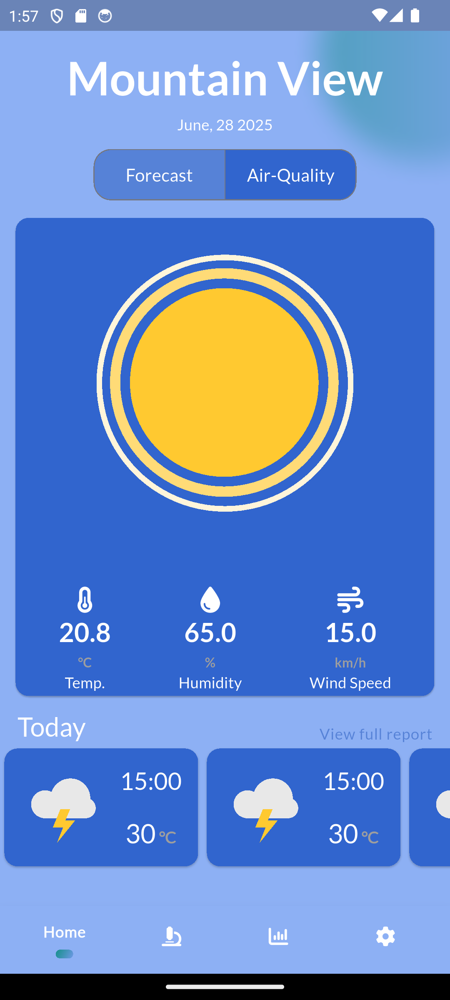

# WetinWeather

WetinWeather is a modern, cross-platform Flutter application that delivers real-time weather and air quality information. Designed for both mobile and tablet devices, WetinWeather combines a beautiful, responsive interface with robust features, making it an ideal companion for anyone who wants to stay informed about weather conditions and air quality wherever they are.

---

## 🌦️ Project Description

WetinWeather is a feature-rich weather and air quality app built with Flutter. It provides users with up-to-date weather forecasts, detailed air quality indices, and a visually engaging experience powered by smooth animations and responsive layouts. The app stands out with its focus on clarity, accessibility, and offline support, ensuring users always have access to essential weather data.

**Recent Updates:**

- **Improved Bloc Architecture:** The Air Quality Bloc now uses a robust state management approach, with clear loading, success, and failure states for better UI feedback and error handling.
- **Environment Variable Safety:** The app now checks for missing or null environment variables before attempting to use them, preventing type casting errors at runtime.
- **API Fallback Logic:** The repository is structured to support fallback to a backup API if the main API fails, increasing reliability.
- **Interceptor Improvements:** The backup API token is now injected safely and efficiently into requests.
- **Type Safety:** All API responses and environment variables are now type-checked before casting, reducing runtime errors.
- **Enhanced Error Handling:** More descriptive error messages and safer exception handling throughout the data layer.

---

## ✨ Features

- **Current Weather:**  
  Instantly view the latest weather conditions for your location or any searched city.

- **Weather Forecasts:**  
  Access hourly and daily forecasts with detailed breakdowns.

- **Air Quality Index (AQI):**  
  Real-time AQI values, pollutant breakdowns, and health recommendations.

- **Detailed Weather Stats:**  
  Includes temperature, humidity, wind speed, pressure, sunrise/sunset times, and more.

- **Responsive UI:**  
  Optimized for both portrait and landscape orientations on phones and tablets.

- **Theming:**  
  Light and dark mode support with smooth transitions.

- **Offline Support:**  
  Caches the last fetched weather and AQI data for offline viewing.

- **Animations:**  
  Engaging Lottie animations for weather conditions and transitions.

- **Seamless Navigation:**  
  Modern routing for a smooth user experience.

- **Search Functionality:**  
  Search for weather and air quality data by city name.

- **Localization Ready:**  
  Easily adaptable for multiple languages and regions.

---

## 📱 Screenshots

| Portrait | Landscape |
|----------|-----------|
|  |  |

*Replace the above image paths with your actual screenshots.*

---

## 🚀 Getting Started

### Prerequisites

- [Flutter SDK](https://flutter.dev/docs/get-started/install) (version 3.10.0 or higher recommended)
- Android Studio or Xcode for platform-specific builds
- A weather API key (e.g., [OpenWeatherMap](https://openweathermap.org/api))
- Ensure your `.env` file contains all required variables:

  ```
  MAIN_BASE_URL=your_main_api_url
  BACKUP_BASE_URL=your_backup_api_url
  BACKUP_TOKEN=your_backup_api_token
  WEATHER_API_KEY=your_weather_api_key
  ```

### Installation

1. **Clone the repository:**

   ```sh
   git clone https://github.com/yourusername/wetinweather.git
   cd wetinweather
   ```

2. **Install dependencies:**

   ```sh
   flutter pub get
   ```

3. **Configure API keys:**
   - Create a `.env` file in the root directory.
   - Add your API keys and URLs as shown above.

4. **Run the app:**

   ```sh
   flutter run
   ```

---

## 🗂️ Project Structure

```
lib/
├── bloc/               # Bloc state management (including air quality bloc)
├── components/         # Reusable widgets and UI components
├── data/
│   └── repositories/   # Data repositories for API and local data
├── models/             # Data models
├── presentation/       # Screens and presentation logic
├── services/           # API clients, interceptors, and utilities
├── theme/              # App theming and styles
├── utilities/          # Constants, helpers, and utilities
├── main.dart           # App entry point
assets/
├── images/             # Weather icons and backgrounds
├── animations/         # Lottie animation files
├── fonts/              # Custom fonts
test/                   # Unit and widget tests
```

- **bloc/**: Contains all Bloc logic and state management.
- **components/**: Reusable UI widgets.
- **data/repositories/**: Handles data fetching and persistence.
- **models/**: Data models for weather and air quality.
- **presentation/**: UI screens and presentation logic.
- **services/**: API clients, interceptors, and related utilities.
- **theme/**: App-wide theming and style definitions.
- **utilities/**: Constants, helpers, and utility functions.
- **assets/**: Images, animations, and fonts.
- **test/**: Unit and widget tests.

---

## 📦 Packages Used

| Package                | Purpose                                      |
|------------------------|----------------------------------------------|
| `flutter_bloc`         | State management (BLoC pattern)              |
| `go_router`            | Declarative navigation and routing           |
| `lottie`               | Animated weather illustrations               |
| `flutter_screenutil`   | Responsive UI scaling                        |
| `percent_indicator`    | Circular and linear percent indicators       |
| `auto_size_text`       | Adaptive text sizing                         |
| `chopper`              | HTTP networking and API integration          |
| `hive`                 | Local storage and caching                    |
| `equatable`            | Value equality for Dart objects              |
| `intl`                 | Date and number formatting                   |
| `build_runner`         | Code generation for models and APIs          |

See [`pubspec.yaml`](pubspec.yaml) for the full list of dependencies.

---

## 🤝 Contribution Guidelines

We welcome contributions! To get started:

1. **Fork the repository**
2. **Create a new branch**  
   `git checkout -b feature/your-feature-name`
3. **Make your changes**
4. **Write tests for your features**
5. **Commit and push**  
   `git commit -m "Add your feature"`  
   `git push origin feature/your-feature-name`
6. **Open a Pull Request**  
   Please ensure your code follows the [Flutter style guide](https://docs.flutter.dev/codelabs/layout-basics#best-practices) and passes all checks.

---

## 🧪 Testing

To run unit and widget tests:

```sh
flutter test
```

---

## 📄 License

This project is licensed under the MIT License. See the [LICENSE](LICENSE) file for details.

---

## 📬 Contact & Support

For questions, suggestions, or issues, please open an [issue](https://github.com/yourusername/wetinweather/issues) or contact the maintainer.

---

**Happy coding! 🚀**
